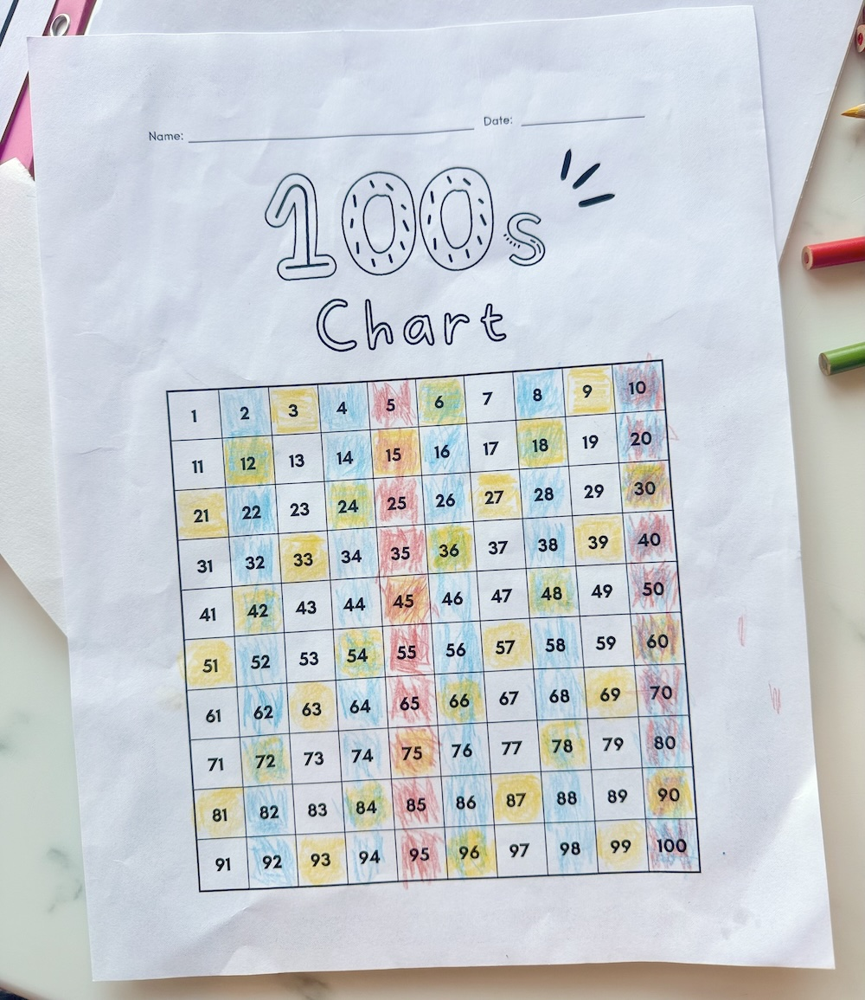

# Polyrhythm Sequencer

An interactive musical sequencer that turns a hundreds chart into polyrhythmic patterns.

**Live Demo:** https://ethanjstark.github.io/polyrhythm-sequencer/

*Disclaimer: The demo will make sounds on mobile, but the visual experience works best on desktop.*

## The Inspiration

New Year's Day 2026. My 6-year-old woke me up to show me this hundreds chart pattern he'd been exploring. I told him it reminded me of music—polyrhythms—and he started singing the numbers back.

## What It Does

- Each "count-by" lane (2s, 3s, 5s, 10s...) hits on multiples of its number
- When rhythms overlap on the same beat, they form chords
- Musical scales keep the harmonies consonant
- Real-time Web Audio synthesis with filtering and space effects

## Try It

1. Open `index.html` in a modern browser
2. Click Play
3. Add lanes, adjust tempo, explore scales
4. Notice how 30 becomes a nice chord (divisible by 2, 3, 5, and 10)

## Architecture

Single-file vanilla HTML/CSS/JavaScript app:
- Pure CSS Grid (10×10 = 100 cells)
- Web Audio API for synthesis
- Chord-aware voicing with automatic octave spreading
- Scheduler-based timing (lookahead + compensation)

No dependencies. No build step. Just open and play.